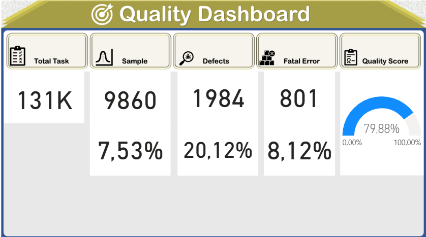
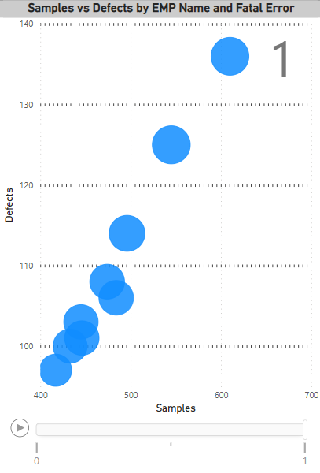
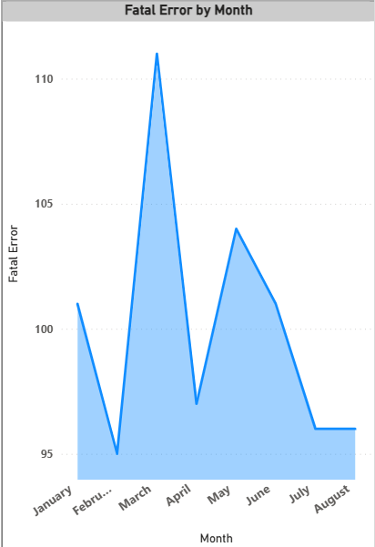
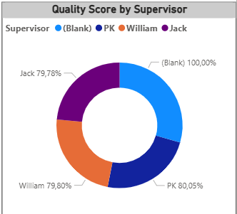
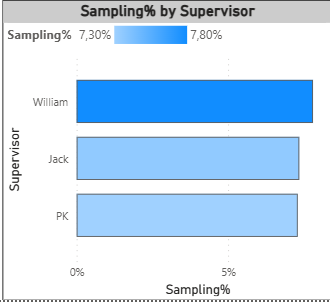
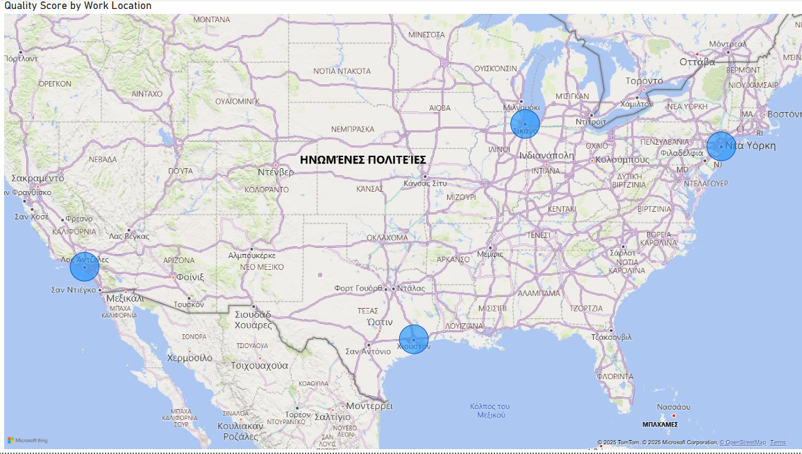
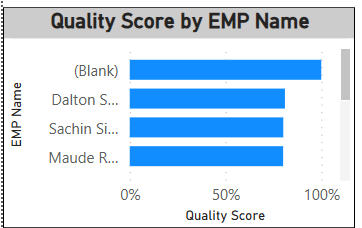
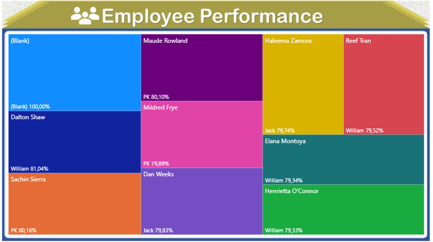

# 📊 Power BI Project: Employee Quality & Performance Dashboard

This Power BI project leverages operational quality data sourced from three tables in an Excel document to create a comprehensive and interactive **Employee Quality Dashboard**. The dataset includes employee and auditor details, task metrics (Total Tasks, Samples, Defects, Fatal Errors) and metadata such as supervisors and work locations. The goal is to transform raw quality control data into powerful visual insights that enable data-driven performance tracking and decision-making.

---

## 📁 Data Sources

- **Quality Data Table**: Contains task-level metrics per employee (Total Task, Samples, Defects, Fatal Errors).
- **Employee Info Table**: Includes EMP ID, EMP Name, Supervisor, and Work Location.
- **Auditor Info Table**: Includes Auditor ID and Auditor Name.

---

## ✅ Project Tasks & Visualizations

### 🔢 Task 1: Create Measures
- `Sampling%` = DIVIDE(Samples, Total Tasks)
- `Defects%` = DIVIDE(Defects, Samples)
- `Fatal Errors%` = DIVIDE(Fatal Errors, Samples)
- `Quality Score` = 1 - Defects%

> All calculations use the `DIVIDE` function to ensure safe division.

---

### 📇 Task 2: Card Visuals
- Display key KPIs using **Card visuals**:
  - Total Tasks
  - Samples
  - Defects
  - Fatal Errors
---

### 🎯 Task 3: Gauge Chart
- Display the `Quality Score` as a **percentage gauge**.
- Place in a prominent area of the report for instant feedback.

---

### ⚖️ Task 4: Scatter Chart
- Visualize the **relationship between Samples and Defects** per `EMP Name`.
- Size data points by `Fatal Errors`.
- Use `Fatal Errors` as a **Play Axis** to show progression.

---

### 📈 Task 5: Area Chart
- Show **Fatal Errors over time by month** to identify trends.

---

### 🍩 Task 6: Donut Chart
- Display **Quality Score by Supervisor**.
- Format data labels to show **Category and Data Value**.

---

### 📊 Task 7: Clustered Bar Chart
- Display `Sampling%` by Supervisor.

---

### 🗺️ Task 8: Map Chart
- Show `Quality Score by Work Location` using a **Map chart**.

> ⚠️ Note: If a map error occurs, go to:  
`File > Options and Settings > Options > Security > Enable “Use map and filled map visuals”`  
Then restart Power BI.

---

### 🧩 Task 9: Tooltips & Page Naming
- Rename the main page: **Quality Dashboard**
- Create a new page:
  - Set as **Tooltip**
  - Rename it to **EMP Tooltip**

---

### 💡 Task 11: Employee Performance by Supervisor
- Create a custom visualization using **critical thinking** to compare employee performance grouped by Supervisor.
- Consider combining multiple measures (e.g., Quality Score, Sampling%) for deeper insights.

---

## 🛠️ Tools Used

- **Power BI Desktop**
- **Excel as Data Source**
- Power BI visuals: Card, Gauge, Scatter, Area, Donut, Clustered Bar, Map

---

## 📈 Outcome

This dashboard empowers stakeholders to:
- Monitor employee performance and quality metrics in real time
- Identify high/low performing supervisors and employees
- Improve audit sampling strategies and quality control

---

## 🧠 Bonus Tip
Enable interactivity between visuals and use **Tooltips** and **Filters** to make the report user-friendly and insightful.

---

🚀 Happy analyzing with Power BI!
